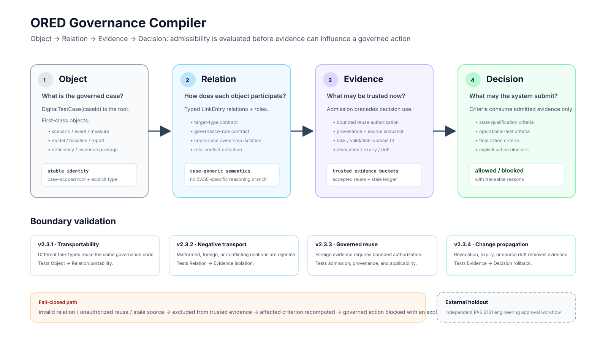

# From Digital Thread to Governed Evidence: An Object–Relation–Evidence–Decision Architecture for Digital Test and Evaluation

**Manuscript status:** v1.0 submission-oriented Markdown draft  
**System baseline:** DTEP v2.4  
**Primary architectural term:** Object–Relation–Evidence–Decision (ORED) Governance Compiler

## Abstract

Digital test and evaluation (T&E) platforms increasingly connect requirements, models, simulation runs, measurements, reports, and review records through a digital thread. Information continuity alone, however, does not establish that an available artifact belongs to the decision currently being made, carries the required governance meaning, is admissible as evidence, or remains admissible after its source changes. This gap becomes consequential when evidence is transported across test cases or reused after model, configuration, or validation-domain changes. We present an Object–Relation–Evidence–Decision (ORED) governance architecture that treats T&E governance as an executable compilation process. A case-scoped object graph first establishes the governed boundary; typed relations and semantic roles determine how objects participate; an evidence layer enforces relation integrity, cross-case isolation, bounded reuse authorization, provenance, applicability, and lifecycle invalidation; and a decision layer evaluates criteria and governed actions using admitted evidence only. The architecture was implemented in the Digital Test & Evaluation Platform (DTEP) prototype while preserving a previously frozen execution, evidence-package, and human-adjudication baseline. Four boundary gates were evaluated. A second, different task type was processed by the same case-generic governance code; malformed and foreign relations were prevented from entering trusted evidence; cross-case evidence was admitted only under an explicit authorization contract; and revocation, expiration, source-content drift, or validation-domain drift removed previously admitted evidence and propagated the resulting deficit to dependent criteria and action blockers. All gates passed together with the existing regression, type-check, lint, production-build, and browser integration tests. The evidence supports a bounded architectural claim: governance semantics can be enforced as a traceable, fail-closed transformation from digital objects to governed decisions in the two synthetic demonstration cases. It does not yet establish cross-organization external validity. We therefore specify a prospective external engineering validation using the independently operated UK Department for Transport / Transport Research Laboratory PAS 2161 road-condition-monitoring approval process, whose 2026 trial outcomes were not available when the protocol was defined.

**Keywords:** digital test and evaluation; digital thread; evidence governance; provenance; ontology; evidence reuse; change propagation; model credibility; qualification; systems engineering

## 1. Introduction

Digital engineering has shifted systems development from document exchange toward connected models, data, analyses, and lifecycle records. The digital-thread literature commonly emphasizes authoritative sources of truth, linkage across heterogeneous artifacts, model integration, and lifecycle traceability [1,2]. SysML v2 similarly strengthens the semantic representation of system structure, requirements, analysis cases, verification cases, and typed relationships, together with standardized services for model access and interoperability [3]. These developments address a central problem of complex engineering programmes: information that was previously fragmented across discipline-specific files can be made discoverable, linked, and machine-accessible.

Discoverability and traceability do not by themselves determine evidentiary admissibility. A model result may be completely traceable to its input data and still be unsuitable for the intended decision because its validation domain does not cover the use case. A test result can be authentic and correctly linked but belong to another configuration or another test case. A previously accepted model can become unsuitable after a version change. A report may refer to the correct test but carry no formal role in the decision under review. The unresolved question is therefore not only whether the digital thread can reconstruct where an artifact came from, but whether the system can determine whether that artifact is currently allowed to influence a specific governed action.

This distinction is well established in adjacent engineering practice. W3C PROV separates entities, activities, agents, derivation, and invalidation so that provenance can support judgments about quality, reliability, and trustworthiness [4]. NASA-STD-7009B requires intended use, acceptance criteria, validation domains, data pedigree, credibility assessments, and maintenance of records when models or the real-world system change [5]. Recent digital-engineering research has similarly emphasized provenance-first workflows and semantic graphs, including automated re-evaluation when requirements change [6,7]. These approaches strengthen traceability and change awareness. They do not, however, directly provide a compact T&E governance mechanism that answers four questions in sequence: which objects are in scope, what their relationships mean, which related objects are admissible evidence, and what actions the admitted evidence permits.

The DTEP prototype was originally developed as an object-centred digital T&E environment with a frozen engineering baseline covering digital-prototype intake, model and environment assembly, readiness, run control, reconstruction, data quality, automated adjudication, evidence packages, expert review, and final human disposition. Subsequent governance work exposed a recurring architectural weakness. When only one demonstration case existed, case-specific identifiers could silently substitute for governance semantics. Adding more data would have increased the size of the prototype without resolving this coupling.

The present work therefore focuses on governance rather than feature expansion. We formulate T&E governance as a four-layer compiler from **objects** to **typed relations**, from relations to **admissible evidence**, and from evidence to **governed decisions**. The architecture is called ORED. It introduces no new top-level business module. Instead, it constrains how existing digital objects are allowed to influence decisions.

The study asks four research questions.

**RQ1 — Case transportability.** Can governance reasoning be separated from case-specific object identifiers so that a materially different task type is processed by the same rule implementation?

**RQ2 — Relation integrity.** Can malformed, semantically conflicting, or cross-case relations be prevented from contaminating the trusted evidence set while normal incompleteness remains distinguishable from graph corruption?

**RQ3 — Governed evidence reuse.** Can evidence from another case be reused only when an explicit authorization contract establishes provenance, object identity, intended governance role, target-task applicability, approval, and validity boundaries?

**RQ4 — Change propagation.** When a reuse authorization is revoked or expires, or when the source evidence changes, can the system remove the affected evidence and propagate the resulting deficit to dependent criteria and actions without adding case-specific revocation logic?

The contributions are correspondingly narrow. First, the paper defines the ORED architecture and a formal separation between relation integrity, evidence admissibility, evidence staleness, and decision eligibility. Second, it implements the architecture in a functioning T&E prototype while preserving the frozen execution and adjudication baseline. Third, it evaluates the boundaries between the four layers using transport, negative-relation, cross-case reuse, and source-change gates. Fourth, it defines a prospective external validation on an independently operated engineering approval process to test whether the same contracts can be mapped outside the DTEP demonstration cases.

## 2. Architecture

### 2.1 Design objective

ORED is intended to prevent an invalid governance inference from being created merely because a digital artifact is present and traceable. The architecture therefore places an admission boundary between the digital graph and the decision rules. Decision logic never queries the complete ontology as an undifferentiated store. It receives only the subset that survives scope, relation, and evidence checks.

Let a governed test case be denoted by (c). Its case-scoped object graph is

[
G_c=(V_c,E_c),
]

where (V_c) contains first-class engineering and governance objects and (E_c) contains typed relations from the case root to those objects. The case root is a stable DigitalTestCase identifier.

For a relation (e in E_c), let

[
R(e) in {0,1}
]

denote structural and semantic validity. (R(e)=1) only if the relation targets the declared object type, uses an allowed governance role, has no conflicting role assignment, and does not introduce ungoverned cross-case ownership.

A structurally valid object is still only a candidate evidence item. Let

[
A(v,c,t) in {0,1}
]

denote evidence admissibility for object (v), case (c), and evaluation time (t). For local evidence, admission depends on the relation and the underlying evidence state. For cross-case evidence, admission additionally requires an authorization whose source case, target case, source object, relation type, governance role, target task type, approval state, validity interval, provenance, source snapshot, and requalification conditions match the use.

The trusted evidence set is then

[
T_c(t)={vin V_c : R(e_v)=1 land A(v,c,t)=1}.
]

Decision criterion (k) is evaluated only from (T_c(t)),

[
C_k(t)=f_k(T_c(t),P_k),
]

where (P_k) denotes non-evidence prerequisites such as required authority or lifecycle state. A governed action (j) is allowed only when all blocking criteria and explicit prerequisites are satisfied:

[
mathrm{Allowed}_j(t)
=
mathbb{I}[mathrm{Authority}_j]
land
igwedge_{kin K_j}
egmathrm{Blocking}(C_k(t))
land
mathbb{I}[mathrm{NoHardIntegrityError}].
]

This ordering is the main architectural constraint. Evidence admissibility is evaluated before evidence can affect (C_k).

### 2.2 Object layer

The object layer answers: **what is being governed?**

DigitalTestCase(caseId) is the root of the evaluation scope. Related scenarios, events, measures, models, model baselines, assemblies, interfaces, reports, deficiencies, evidence packages, and other artifacts are represented as first-class objects. Stable identities replace implicit references based on filenames, UI locations, or hard-coded constants.

The object layer does not decide whether an object is evidence. Its role is narrower: establish identity, type, and case scope. This separation is important because a technically valid ModelAsset and a formally admissible model-evidence item are different concepts. The former can exist in the ontology while the latter is excluded from a particular decision.

### 2.3 Relation layer

The relation layer answers: **how does an object participate in the current case?**

A typed LinkEntry connects the case root to a target object. The relation type constrains the target object class. Relation properties can declare semantic roles such as a qualification-performance anchor, an operational-evidence anchor, an operational-effectiveness measure, or a formal digital-model review input.

Four constraints are evaluated before a related object can become candidate evidence.

1. **Target-type contract.** A relation such as caseUsesEvent cannot silently point to a Measure.
2. **Governance-role contract.** A governance role is legal only for the relation types that define it.
3. **Role consistency.** The same target cannot simultaneously acquire mutually exclusive governance meanings under the same relation.
4. **Cross-case ownership isolation.** Evidence already owned by another case is foreign unless an explicit cross-case reuse process is invoked.

Violations are structural integrity errors. They are recorded separately from normal incompleteness. A missing performance-test relation means that a case lacks evidence for a criterion. It does not mean that the ontology is corrupt. A relation pointing to the wrong object type is different: the relation itself is invalid and is excluded before evidence evaluation.

Removing case-specific identifiers from the reasoning code is essential to transportability. CASE-01 and CASE-02 therefore differ through ontology objects and relation properties, not through conditional branches in the governance implementation.

### 2.4 Evidence layer

The evidence layer answers: **which related objects may be trusted for this decision now?**

For same-case evidence, structurally valid related objects are grouped by governance role and evaluated according to their recorded state. Cross-case reuse introduces a stricter admission contract because provenance alone does not establish applicability.

An EvidenceReuseAuthorization freezes the following information:

- source and target case;
- source object type and identity;
- target relation type;
- governance roles that the object is allowed to assume;
- approved target task types;
- purpose and equivalence basis;
- provenance reference;
- source snapshot reference and canonical source-content digest;
- source validation-domain snapshot;
- source-side and target-side approvers;
- approval state and validity interval;
- limitations; and
- requalification triggers.

A cross-case relation cannot enter the trusted evidence set unless the corresponding authorization matches this contract. Authorization is bounded permission. It does not transfer the source case's final judgment, increase evidence quality, expand the source validation domain, or convert a VV&A input into a formal qualification conclusion.

Lifecycle change is handled as evidence staleness rather than ontology corruption. For an authorized source object (v), a canonical digest (H(v)) is stored at approval time as (h_0). The source validation domain (D(v)) is also frozen as (D_0). Reused evidence becomes stale when, for example,

[
H(v_t)
eq h_0,
]

[
D(v_t)
eq D_0,
]

the authorization is revoked, or the authorization expires. A stale item is moved out of the trusted evidence set and recorded in a stale ledger with an explicit reason. Structural errors and lifecycle staleness therefore produce the same conservative evidentiary effect—exclusion—but remain distinguishable for diagnosis and recovery.

### 2.5 Decision layer

The decision layer answers: **what may the system do with the admitted evidence?**

The current prototype contains governed actions for state-qualification review, authorization to enter operational testing, and fielding/finalization review. Each action is derived from a set of criteria rather than enabled by a client-side permission check.

Criterion states distinguish evidence that is ready, partially supportive, blocked, or not yet modeled. Evidence-coverage percentages are descriptive and cannot cancel a hard prerequisite. A missing formal approval therefore remains blocking even when many other criteria are supported.

Change propagation requires no separate action-specific invalidation engine. When evidence becomes stale, it is removed from (T_c(t)). The affected criterion is recomputed. The existing action logic then receives the updated criterion state and emits the corresponding blocker. The propagation path is therefore

[
	ext{source change}

ightarrow
	ext{evidence stale}

ightarrow
T_c(t)	ext{ updated}

ightarrow
C_k(t)	ext{ recomputed}

ightarrow
	ext{action blocker}.
]

### 2.6 Relationship to the frozen DTEP baseline

ORED is a governance overlay rather than a replacement for the previously frozen v2.1 business architecture. The underlying prototype continues to distinguish model execution from ontology control, immutable machine adjudication from human disposition, and frozen evidence packages from mutable current ontology state. ORED governs which case-scoped evidence can enter decision criteria above that baseline.

This separation reduces the risk that architecture consolidation becomes another platform redesign. The experimental variable is governance admissibility, not run execution, data-quality processing, or expert-review workflow.

## 3. Evaluation

### 3.1 Evaluation strategy

The evaluation was organized around interfaces between ORED layers rather than around feature count. Four gates correspond to the four questions in the Introduction.

The prototype uses synthetic/demo engineering material. CASE-01 is the original frozen demonstration case. CASE-02 was deliberately constructed as a different reliability/maintainability/supportability task so that transportability could not be demonstrated by merely renaming an object within the original mission type. No third internal case was added after the transportability mechanism was established.

All governance gates were executed in continuous integration after restoration of the frozen database and the required ontology migrations. The pre-existing architecture audit was run before the governance migrations so that the frozen v2.1 baseline remained independently testable.

### 3.2 Gate 1: second-case transportability

The first gate tested whether the governance resolver and rules remained independent of CASE-01 identifiers.

The governance entry point was changed to build a snapshot from an explicit caseId. The resolver traversed first-class ontology relations and interpreted governanceRole properties. Static checks prohibited CASE-01, CASE-02, and case-specific event, measure, and model identifiers from appearing in the core resolver and governance compiler.

CASE-02 introduced a reliability/maintainability/supportability task with different events, measures, models, and scenarios. The same governed-action vocabulary and rule implementation processed both cases.

**Result.** Both cases were resolved by the same case-generic path. CASE-02 did not require case-specific branches. The evidence supports RQ1 within the two demonstration cases.

### 3.3 Gate 2: relation completeness and negative transport

The second gate separated normal incompleteness from relation corruption.

Five negative conditions were exercised: removal of a required relation, target-type mismatch, cross-case contamination, use of a governance role on an unsupported relation, and conflicting roles on the same target. The missing relation was expected to block only the dependent criterion. The other four conditions were expected to be recorded as hard relation-integrity errors and excluded before entering trusted evidence buckets.

Cross-case contamination was tested using an object that did not rely on an embedded caseId. Ownership was inferred from reverse case relations, preventing older objects with incomplete case metadata from bypassing isolation.

**Result.** Missing evidence produced stage-specific incompleteness. Malformed or foreign relations produced explicit integrity errors, were excluded from trusted evidence, and hard-blocked governed actions. This supports RQ2 for the tested failure classes.

### 3.4 Gate 3: governed cross-case evidence reuse

The third gate tested whether foreign evidence could enter a target case only under a bounded authorization.

Six scenarios were evaluated: a bare shared flag without authorization, authorization/object mismatch, inactive authorization, target-domain mismatch, incomplete provenance or requalification metadata, and a complete approved authorization. Rejected reuse was required to leave object and semantic-role evidence counts unchanged.

For the accepted scenario, a model from CASE-01 was reused as an allowed formal digital-model review input for CASE-02. The authorization preserved the source case, target case, object identity, governance role, provenance reference, source snapshot, limitations, and requalification triggers.

**Result.** Only the complete authorization admitted the model into the target evidence bucket. The model's existing VV&A status could contribute as an input, but the authorization did not upgrade that input into a formal digital-model review conclusion. This supports RQ3 and establishes the distinction between evidence reuse and conclusion inheritance.

### 3.5 Gate 4: reuse revocation and change propagation

The fourth gate tested lifecycle invalidation after previously valid reuse.

The CASE-02 native digital-model input was temporarily removed so that the authorized CASE-01 model became the sole input to the relevant criterion. The accepted state was verified first. Four changes were then introduced independently:

- authorization revocation;
- authorization expiration;
- source-object content/version change producing a digest mismatch; and
- source validation-domain change.

Each change was required to leave ontology integrity valid, create one explicit stale-reuse record, remove the reused model from the trusted governance-role bucket, change the dependent digital-model criterion from partial to blocked, and propagate the same reason into the state-qualification action blocker. The original source and authorization states were then restored.

**Result.** All four invalidation conditions propagated through the expected chain. Restoring the exact authorized source state reactivated the evidence and recovered the criterion. This supports RQ4 in synchronous prototype evaluation.

### 3.6 Consolidation gate

A v2.4 consolidation gate audited the relationship between the architecture definition, runtime snapshot, decision criteria, product UI, and manuscript narrative.

For both CASE-01 and CASE-02, accepted plus rejected relations had to account for the complete resolved relation set; runtime hard-error counts had to equal the integrity ledger; accepted and stale reuse counts had to equal the evidence-admission state; trusted-evidence counts had to be derived from semantic-role buckets; and criterion/action counts had to match the decision-layer output. The architecture and resolver were also checked again for case-specific evidence identifiers.

**Result.** The consolidated Object–Relation–Evidence–Decision representation was consistent with the same runtime state used by the product. The consolidation did not introduce a parallel reporting model.

### 3.7 Engineering regression

The governance work was evaluated together with the existing engineering baseline. The complete pipeline passed:

- ontology graph and SysML-oriented validation;
- frozen architecture and evidence audit;
- CASE-01 governance regression;
- second-case transportability;
- negative relation transport;
- governed cross-case reuse;
- revocation and change propagation;
- v2.4 architecture consolidation;
- TypeScript type checking;
- ESLint;
- Next.js production build;
- real Chromium engineering integration; and
- real Next.js product smoke testing in OIDC mode.

These tests establish implementation consistency. They are not evidence of operational effectiveness or institutional acceptance.

### 3.8 Prospective external engineering validation

Internal mutation testing cannot establish that ORED's four contracts are sufficient in an independently designed engineering process. We therefore define a prospective holdout validation using the UK Department for Transport (DfT) PAS 2161 road-condition-monitoring approval process operated by the Transport Research Laboratory (TRL).

The choice is deliberate. PAS 2161 is outside the DTEP domain and was designed independently. The 2025 demonstration used three approximately 100 km local-authority networks, engineer benchmark data, technology submissions, repeated-route measurements, defined accuracy and repeatability tests, explicit pass criteria, and a final demonstrated/not-demonstrated decision. Nine technologies were reported as successfully demonstrated and approved for network use [8,9]. The 2025 report also states that demonstrated status applies only while the provider continues to use the same methods and contractual arrangements used in the trial [8], creating a real change-governance requirement rather than a synthetic analogue.

The external holdout will use the 2026 PAS 2161 demonstration process, not the 2025 outcomes used to understand the workflow. TRL's 2026 materials identify different local-authority trial networks—Cheshire West and Chester, Lincolnshire, and Nottinghamshire—and specify independent main-route, repeat-route, benchmark, quality-assurance, submission, and approval artifacts [10,11]. At the time this protocol was fixed, the final 2026 demonstrated/not-demonstrated outcomes were not yet available. This timing prevents tuning the ORED mapping to the final external decisions.

The detailed preregistered protocol is maintained separately in EXTERNAL_VALIDATION_PAS2161_PROTOCOL.md. The minimum external validation has three endpoints.

1. **Contract mapping completeness.** All artifacts required to reproduce one technology's approval path must be representable using the four ORED layers without adding a fifth layer or case-specific rule branch.
2. **Decision reconstruction.** When an official technology assessment report containing the required metrics is available, ORED must reproduce the demonstrated/not-demonstrated outcome using the frozen PAS 2161 rule representation. Agreement is binary and must be exact for the evaluated technology.
3. **Change-propagation validity.** A documented change to a method, contractual arrangement, QA state, or other source condition covered by the approval must invalidate the affected evidence or approval relation until the required reassessment condition is satisfied. The expected outcome is fail closed, with a trace from changed source to blocked decision use.

The minimal sample is one technology with a complete official assessment package. Additional technologies increase breadth but are not required for the first external-validity gate. If no technology-level assessment report is made available publicly or by a consenting provider, only the mapping endpoint can be completed; the study will not substitute aggregate public pass counts for independent decision reconstruction.

## 4. Discussion

### 4.1 Principal finding

The main result is architectural rather than algorithmic. A digital T&E environment can preserve a detailed digital thread and still make an invalid decision inference if it does not distinguish availability from admissibility. ORED makes this distinction explicit by introducing two intermediate contracts between digital objects and governed actions: relation semantics and evidence admission.

The experimental sequence supports the utility of that separation. Transportability required removing case identity from rule code. Negative transport required separating missing evidence from malformed graph structure. Cross-case reuse required making applicability and authorization explicit. Change propagation required treating previously valid evidence as a time-dependent state rather than a permanent property. These mechanisms became simpler when assigned to layer boundaries than when expressed as exceptions inside individual lifecycle actions.

### 4.2 Relationship to digital thread and semantic engineering

Digital-thread research emphasizes connectivity, authoritative data, lifecycle traceability, and reuse [1,2]. ORED assumes those capabilities but adds an explicit governance question: what may the connected information currently support? The distinction is similar to the difference between provenance and trust. W3C PROV can represent where an entity came from and how it changed [4]; ORED uses provenance as one input to an admission decision.

The use of typed objects and relations is also consistent with the direction of SysML v2, which gives analysis and verification cases, requirements, connections, and metadata explicit semantics [3]. ORED does not depend on SysML v2 as a storage format, however. Its architectural requirement is that the governance-relevant identity and relationship semantics are machine-interpretable.

NASA-STD-7009B provides a useful external analogue for the evidence layer. Intended use, validation domain, acceptance criteria, pedigree, and reassessment after change are treated as explicit credibility information rather than assumed properties of a model [5]. ORED generalizes the same logic to any reused governance evidence object. The DLR work on provenance-aware semantic graphs similarly shows that explicit mappings can support automatic re-evaluation after engineering requirements change [7]. ORED differs in its endpoint: the propagated state is not only model compliance but eligibility of evidence to support a governed T&E action.

### 4.3 Why bounded reuse matters

Engineering programmes frequently seek to reuse prior test results, models, analyses, or qualification evidence. Unbounded reuse is attractive because it reduces test cost, but it also creates a hidden coupling between two decisions. A source artifact can remain technically unchanged while the target intended use moves outside its validated domain; conversely, the target use can remain unchanged while the source version changes.

The reuse authorization in ORED therefore records both relational identity and evidence applicability. This is intentionally stricter than a shared flag or a provenance link. The design also prevents a common semantic error: permission to reuse evidence is not permission to inherit the source decision. A validated model can be reused as an input while a formal target-case conclusion remains incomplete.

### 4.4 Change propagation as governance rollback

The v2.3.4 result suggests that change propagation need not be implemented as a growing set of action-specific exception handlers. If admission is evaluated before decision use, change handling can operate by removing invalidated evidence from the trusted set. Criteria and action eligibility then recompute from the same rule path used in the original decision.

This has two advantages. First, the audit trail remains local: the system can identify which evidence became stale and why. Second, recovery is well defined. Restoring the authorized state, or issuing a new authorization after reassessment, returns the evidence to the normal admission path.

The current implementation evaluates these changes synchronously. A distributed production environment would require event delivery, concurrency handling, version ordering, and transactional guarantees that are outside this prototype.

### 4.5 External-validity strategy

The PAS 2161 validation is intentionally small. The aim is not to demonstrate that ORED can model every engineering approval domain. The aim is to challenge the four-layer contracts with a process that was created by another organization, uses different engineering objects and terminology, and produces an operational approval decision.

The prospective design improves the evidentiary value of this test. The 2025 documentation can be used to freeze the mapping rules, but the 2026 trial uses different routes and future outcomes. ORED therefore cannot be tuned after observing the external result. The validation will be considered successful only if the frozen four-layer mapping is sufficient and, where technology-level assessment evidence is available, the official decision can be reconstructed without introducing a PAS2161-specific architecture layer.

A failure would also be informative. If the external process requires a concept that cannot be represented as object identity, relation semantics, evidence admissibility/state, or decision criteria, the architecture is incomplete. If the mapping is possible but official decisions cannot be reconstructed from available evidence, the limitation may instead be observability or data access.

### 4.6 Limitations

The internal evaluation uses two synthetic/demo cases and deliberately injected relation and lifecycle faults. These tests establish deterministic enforcement of stated invariants; they do not estimate error rates in real engineering programmes.

The current decision rules cover a bounded set of prototype lifecycle actions. Institutional approval chains, organization-specific delegations, classified evidence, contractual restrictions, and distributed sign-off processes may require additional object types and policies. Such extensions should remain inside the four layers if the architecture is sufficient, but this has not yet been demonstrated.

The cross-case authorization model treats the target task type and validation domain as explicit applicability descriptors. Real equivalence arguments can be substantially more complex and may require quantitative similarity models, expert judgment, uncertainty analysis, or formal tailoring decisions.

Content-addressed source snapshots detect change, not significance. A semantically irrelevant metadata edit can change a digest, whereas a domain expert may judge some substantive changes acceptable. A production implementation should therefore pair automatic invalidation with governed reassessment rather than equating every digest change with permanent rejection.

The external PAS 2161 validation is prospective. Until a complete 2026 technology-level assessment package and official outcome are available, it remains a protocol rather than external performance evidence.

### 4.7 Implications

The strongest supported claim is that ORED provides a coherent control point between a digital thread and a governed decision. This reframes T&E platform architecture. More data integration does not necessarily improve decision trustworthiness if admissibility remains implicit. Conversely, explicit admission contracts can make a relatively small object graph safer to reason over because incorrect relations, inappropriate reuse, and stale evidence are removed before decision evaluation.

The architecture is also compatible with incremental adoption. Existing digital-thread systems can retain their native data and execution tools while exposing governance-relevant objects, typed relationships, source snapshots, and decision criteria through an overlay. The DTEP implementation follows this pattern: model execution and the frozen v2.1 evidence/adjudication chain were not rewritten to support ORED.

The next research decision should therefore depend on the external gate rather than on further internal feature expansion. A successful PAS 2161 holdout would justify testing ORED across additional organizations or more complex equivalence/reuse cases. A failure should first be analyzed as a missing contract, missing observable evidence, or domain-specific policy requirement before the architecture is enlarged.

## References

1. U.S. Department of Defense. **Digital Engineering Strategy.** 2018. https://www.cto.mil/wp-content/uploads/2018/06/2018-Digital-Engineering-Strategy_Approved_PrintVersion.pdf
2. Zhang et al. **A Literature Review of the Digital Thread: Definition, Key Technologies, and Applications.** Systems. 2024;12(3):70. https://www.mdpi.com/2079-8954/12/3/70
3. Object Management Group. **OMG Systems Modeling Language (SysML), Version 2.0.** Formal specification, September 2025. https://www.omg.org/spec/SysML/
4. W3C. **PROV-DM: The PROV Data Model.** W3C Recommendation. https://www.w3.org/TR/prov-dm/
5. NASA. **NASA-STD-7009B: Standard for Models and Simulations.** Approved 5 March 2024. https://standards.nasa.gov/standard/NASA/NASA-STD-7009
6. Legensky SM, Amels D, Makinen SM. **Enabling Scalable Provenance-Based Data Management for Digital Engineering Workflows: A Semantically Grounded Approach for HPC Scale CFD.** AIAA SciTech 2026. https://doi.org/10.2514/6.2026-1529
7. Ruß P, Schegk G, Valente D, et al. **Traceable Intercorporation Data Exchange and Processing Using a Graph-Based Infrastructure.** Engineering Proceedings. 2026;133:196. https://doi.org/10.3390/engproc2026133196
8. Muller B, Brittain S, Thomas C, Mohamed W, Workman R. **PAS 2161: Road Condition Monitoring Trials Report 2025.** TRL PPR2083, final report, 27 February 2026. https://www.trl.co.uk/uploads/trl/documents/TRL-PAS2161-2025-RCM-Trials-Final-Report.pdf
9. UK Department for Transport. **Road condition monitoring standard – PAS 2161.** Updated 26 September 2025. https://www.gov.uk/government/publications/road-condition-monitoring-standard-pas-2161/road-condition-monitoring-standard-pas-2161
10. Transport Research Laboratory. **PAS 2161 Technology Providers – Briefing 2.** 16 July 2026. https://pas2161.trl.co.uk/wp-content/uploads/2026/07/PAS-2161-Technology-Providers-16-07-2026.pdf
11. Transport Research Laboratory. **PAS 2161 Demonstration Trial Routes / FAQs / Quality Assurance resources.** 2026 trial materials. https://pas2161.trl.co.uk/

## Claim–Evidence–Boundary audit

| Manuscript claim | Direct evidence | Boundary retained |
|---|---|---|
| Core governance reasoning is case-generic | CASE-01/CASE-02 transportability gate; static source checks | Two internal demonstration cases |
| Malformed or foreign relations are excluded before decision use | v2.3.2 negative relation injections | Tested failure classes only |
| Cross-case evidence requires explicit bounded authorization | v2.3.3 reject/accept scenarios | Prototype authorization semantics |
| Evidence can become stale after a previously valid decision path | v2.3.4 revocation, expiry, digest and domain drift | Synchronous state evaluation |
| Stale evidence propagates to dependent actions | SQ-DM isolated propagation gate and action blocker | Demonstrated criteria/actions only |
| ORED is internally coherent as one architecture | v2.4 consolidation gate | Internal consistency, not external validity |
| ORED is externally transportable | Not yet established | Prospective PAS 2161 validation is required before making this claim |
